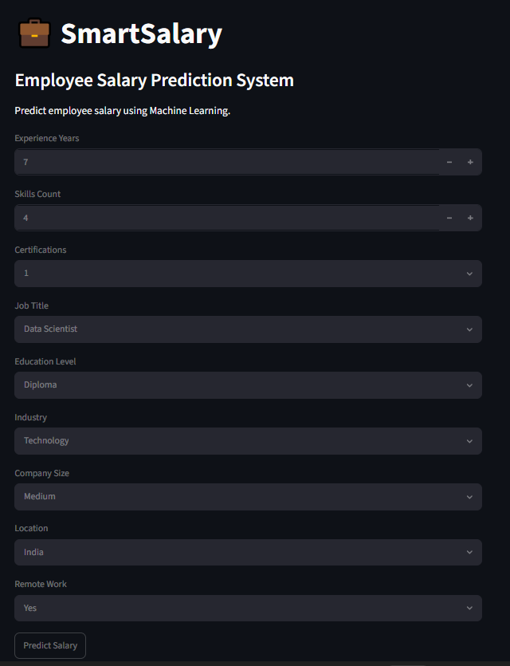
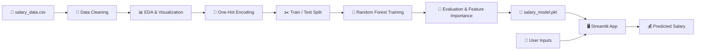
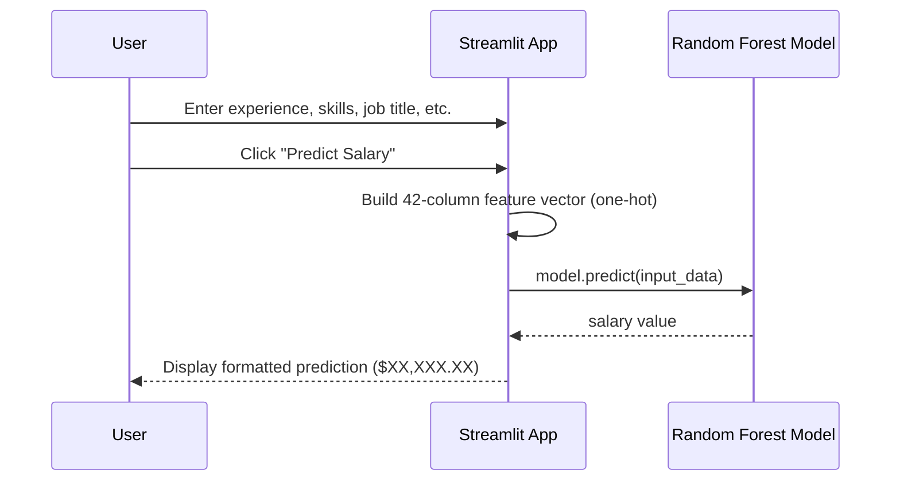
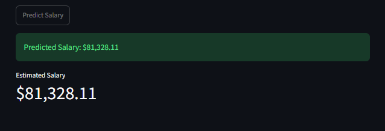

<p align="center">
  
</p>

<div align="center">

# 🚀 SmartSalary

### *Machine Learning–Powered Employee Salary Prediction & Workforce Analytics*

Predict employee compensation with a **Random Forest** model trained on **250,000** workforce records — delivered through an interactive **Streamlit** web app and a complete **Jupyter** ML pipeline.

<br/>

[](https://www.python.org/)
[](https://streamlit.io/)
[](https://scikit-learn.org/)
[](https://pandas.pydata.org/)
[](https://jupyter.org/)

[](https://github.com/Ramya-Ramadoss/SmartSalary-Employee-Salary-Predictionn)
[](https://github.com/Ramya-Ramadoss/SmartSalary-Employee-Salary-Predictionn/releases)
[](#-license)
[](https://github.com/Ramya-Ramadoss/SmartSalary-Employee-Salary-Predictionn/commits/main)
[](https://github.com/Ramya-Ramadoss/SmartSalary-Employee-Salary-Predictionn/stargazers)
[](https://github.com/Ramya-Ramadoss/SmartSalary-Employee-Salary-Predictionn/network/members)
[](https://github.com/Ramya-Ramadoss/SmartSalary-Employee-Salary-Predictionn/issues)

<br/>

| 🌐 **Live Demo** | 📖 **Documentation** | 🎥 **Demo Video** | 📦 **Repository** |
| :---: | :---: | :---: | :---: |
| [Add Deployment Link Here](#-live-demo) | [Add Docs Link Here](#-live-demo) | [Add YouTube Link Here](#-live-demo) | [SmartSalary on GitHub](https://github.com/Ramya-Ramadoss/SmartSalary-Employee-Salary-Predictionn) |

<br/>



> *Streamlit prediction interface — enter workforce attributes and get an instant salary estimate.*

</div>

---

## 📑 Table of Contents

- [Project Overview](#-project-overview)
- [Features](#-features)
- [Tech Stack](#-tech-stack)
- [Project Architecture](#-project-architecture)
- [Screenshots](#-screenshots)
- [Live Demo](#-live-demo)
- [Installation](#-installation)
- [Usage](#-usage)
- [Folder Structure](#-folder-structure)
- [Configuration](#-configuration)
- [API Documentation](#-api-documentation)
- [Machine Learning / AI](#-machine-learning--ai)
- [Performance](#-performance)
- [Security](#-security)
- [Roadmap](#-roadmap)
- [Future Enhancements](#-future-enhancements)
- [Contributing](#-contributing)
- [License](#-license)
- [Author](#-author)
- [Acknowledgements](#-acknowledgements)
- [Support](#-support)

---

## 📋 Project Overview

**SmartSalary** is an end-to-end machine learning project that predicts employee salaries based on professional and organizational attributes — experience, education, job role, industry, company size, location, and more.

### The Problem

Employee compensation is shaped by many interacting factors. HR teams, job seekers, and analysts often lack data-driven tools to estimate fair salary ranges or understand which attributes drive pay differences across roles and geographies.

### Why SmartSalary Was Built

This project demonstrates a **complete ML workflow** — from exploratory data analysis and feature engineering through model training, evaluation, feature importance analysis, and deployment as an interactive web application.

### Key Objectives

| Objective | Description |
| :--- | :--- |
| 🎯 **Accurate Prediction** | Build a regression model that explains salary variation with high R² |
| 📊 **Workforce Insights** | Identify the most influential compensation drivers |
| 🖥️ **Accessible Interface** | Expose predictions through a simple Streamlit UI |
| 🔄 **Reproducible Pipeline** | Document the full workflow in a Jupyter notebook |

### Who Can Use It

| Audience | Use Case |
| :--- | :--- |
| 👩‍💻 **Data Scientists & ML Engineers** | Study a full regression pipeline with EDA, encoding, and deployment |
| 📈 **HR & Workforce Analysts** | Explore salary drivers and run what-if predictions |
| 🎓 **Students & Learners** | Learn supervised regression, Random Forest, and Streamlit integration |
| 💼 **Job Seekers** | Estimate salary ranges based on profile attributes *(informational only)* |

---

## ✨ Features

### 🧠 Core Features

- 📂 **Large-scale dataset processing** — 250,000 employee records with 10 workforce attributes
- 🧹 **Data cleaning** — missing-value checks and duplicate removal
- 📈 **Exploratory Data Analysis** — salary distribution and categorical/numerical relationship plots
- 🔢 **One-hot encoding** — categorical features converted via `pandas.get_dummies`
- 🌲 **Random Forest Regressor** — primary production model with **96.09% R²**
- 📉 **Model comparison** — Linear Regression baseline evaluated alongside Random Forest
- 🔍 **Feature importance analysis** — top predictors ranked and visualized
- 💾 **Model serialization** — trained model saved with Joblib (`salary_model.pkl`)

### 🤖 AI / ML Features

- Supervised **regression** problem (continuous salary target)
- **80/20 train–test split** for unbiased evaluation
- **RMSE** and **R²** metrics for model assessment
- Real-time inference through the Streamlit app using the same 42-feature schema as training

### 🎨 UI / UX Features

- 💼 Branded Streamlit interface with centered layout
- 📝 Dropdown and numeric inputs for all model features
- ⚡ One-click **Predict Salary** button
- ✅ Success banner and **metric card** for formatted salary output (`$XX,XXX.XX`)
- 🌙 Clean dark-theme Streamlit styling

### 🔒 Security Features

> This is a local, single-user ML demo. No authentication, authorization, or network API layer is implemented.

- Input bounds on numeric fields (`min_value` / `max_value`)
- Graceful model-load error handling with user-facing messages
- Sensitive artifacts excluded via `.gitignore` (dataset, model, virtual env)

### ⚡ Performance Features

- Random Forest inference is near-instant for single predictions
- Pre-defined feature column schema avoids runtime encoding overhead in the app
- Joblib model loading cached for the Streamlit session

### 🛠️ Developer Features

- 📓 Reproducible Jupyter notebook (`notebooks/01_EDA.ipynb`)
- 📦 Pinned dependencies in `requirements.txt`
- 📁 Organized project layout (`app/`, `models/`, `data/`, `src/`, `reports/`)
- 🔧 Placeholder `src/` package for future modularization

---

## 🛠 Tech Stack

| Category | Technologies |
| :--- | :--- |
| **Frontend / UI** | [Streamlit](https://streamlit.io/) 1.58 |
| **Backend** | Python 3.10+ *(in-process; no separate server)* |
| **Database** | *None — CSV file storage (`data/salary_data.csv`)* |
| **AI / ML Frameworks** | [scikit-learn](https://scikit-learn.org/) 1.7, [XGBoost](https://xgboost.ai/) 3.2 *(listed in deps; not yet used in notebook)* |
| **Libraries** | Pandas, NumPy, Matplotlib, Seaborn, Joblib |
| **APIs** | *None — no REST/GraphQL endpoints* |
| **Authentication** | *Not implemented* |
| **Cloud / Hosting** | *Not deployed — local Streamlit only* |
| **Deployment** | Streamlit CLI (`streamlit run app/app.py`) |
| **Dev Tools** | Jupyter Notebook, Git, GitHub, pip, venv |

---

## 🏗 Project Architecture

### Folder Structure Overview

```text
SmartSalary-Employee-Salary-Prediction/
├── app/                  # Streamlit web application
├── data/                 # Dataset (gitignored)
├── models/               # Trained model artifacts (gitignored)
├── notebooks/            # EDA & model training notebook
├── reports/              # Generated reports (placeholder)
├── src/                  # Python source package (placeholder)
├── requirements.txt
├── README.md
├── image.png             # App screenshot — input form
└── image-1.png           # App screenshot — prediction result
```

### Data Flow



### Application Workflow



<details>
<summary><strong>📂 Detailed component responsibilities</strong></summary>

| Component | Role |
| :--- | :--- |
| `data/salary_data.csv` | Source dataset — 250K rows, 10 columns |
| `notebooks/01_EDA.ipynb` | Full pipeline: EDA → encoding → training → export |
| `models/salary_model.pkl` | Serialized Random Forest Regressor |
| `app/app.py` | Loads model, collects inputs, runs inference |
| `src/` | Reserved for future reusable modules |
| `reports/` | Reserved for exported analysis reports |

</details>

---

## 📸 Screenshots

### Prediction Form


*Enter experience, skills, certifications, job title, education, industry, company size, location, and remote work preference.*

### Prediction Result



*Instant salary estimate displayed as a success message and metric card.*

<details>
<summary><strong>📷 Additional screenshot placeholders</strong></summary>

> Add your screenshots here as the project grows.

#### EDA — Salary Distribution

``

#### EDA — Experience vs Salary

``

#### Feature Importance

``

</details>

---

## 🌐 Live Demo

| Resource | Link |
| :--- | :--- |
| 🌐 **Live Demo** | **[Add Deployment Link Here]** |
| 🎥 **Demo Video** | **[Add YouTube Link Here]** |
| 📄 **Documentation** | **[Add Docs Link Here]** |

> Deploy the Streamlit app to [Streamlit Community Cloud](https://streamlit.io/cloud), [Render](https://render.com/), or [Hugging Face Spaces](https://huggingface.co/spaces) and update the links above.

---

## 📥 Installation

### Prerequisites

- **Python 3.10+**
- **pip** package manager
- **Git**

### 1. Clone the Repository

```bash
git clone https://github.com/Ramya-Ramadoss/SmartSalary-Employee-Salary-Predictionn.git
cd SmartSalary-Employee-Salary-Predictionn
```

### 2. Create a Virtual Environment *(recommended)*

```bash
# Windows
python -m venv venv
venv\Scripts\activate

# macOS / Linux
python3 -m venv venv
source venv/bin/activate
```

### 3. Install Dependencies

```bash
pip install -r requirements.txt
```

### 4. Dataset Setup

The dataset is **not included** in the repository (listed in `.gitignore`).

Place your dataset at:

```text
data/salary_data.csv
```

Expected columns:

| Column | Type | Description |
| :--- | :--- | :--- |
| `job_title` | string | Employee role |
| `experience_years` | int | Years of professional experience |
| `education_level` | string | Highest education attained |
| `skills_count` | int | Number of skills |
| `industry` | string | Industry sector |
| `company_size` | string | Organization size category |
| `location` | string | Geographic location |
| `remote_work` | string | Remote work arrangement |
| `certifications` | int | Certification count / flag |
| `salary` | int | Target — annual salary (USD) |

### 5. Train & Export the Model

The trained model file is **not included** in the repository (exceeds GitHub size limits).

```bash
jupyter notebook notebooks/01_EDA.ipynb
```

Run all cells. The notebook will:

1. Load and clean the dataset
2. Perform EDA and feature engineering
3. Train Random Forest and Linear Regression models
4. Save the model to `models/salary_model.pkl`

### 6. Run the Application Locally

```bash
cd app
streamlit run app.py
```

Open the URL shown in the terminal (typically `http://localhost:8501`).

### Production Deployment

```bash
# Example: Streamlit Community Cloud
# 1. Push repo to GitHub
# 2. Connect at share.streamlit.io
# 3. Set main file path: app/app.py
# 4. Ensure models/salary_model.pkl is available (Git LFS or cloud storage)
```

<details>
<summary><strong>🐳 Docker support (planned)</strong></summary>

Docker is not yet configured. A future `Dockerfile` could containerize the Streamlit app with the model artifact mounted as a volume.

</details>

---

## 🚀 Usage

### Web Application

1. **Launch** the Streamlit app (`streamlit run app.py` from the `app/` directory).
2. **Fill in** your workforce profile:
   - Experience Years *(0–50)*
   - Skills Count *(0–50)*
   - Certifications *(0 or 1)*
   - Job Title, Education Level, Industry, Company Size, Location, Remote Work
3. **Click** `Predict Salary`.
4. **View** the estimated annual salary in USD.

### Example Workflow

| Step | Action | Example Input |
| :---: | :--- | :--- |
| 1 | Set experience | 7 years |
| 2 | Set skills | 4 |
| 3 | Select role | Data Scientist |
| 4 | Select education | Diploma |
| 5 | Select industry | Technology |
| 6 | Select company size | Medium |
| 7 | Select location | India |
| 8 | Select remote work | Yes |
| 9 | Predict | **→ $81,328.11** |

### Notebook Workflow

Open `notebooks/01_EDA.ipynb` to:

- Explore salary distributions and relationships
- Compare Linear Regression vs Random Forest
- Visualize top-10 feature importances
- Export the production model

---

## 📁 Folder Structure

```text
SmartSalary-Employee-Salary-Prediction/
│
├── app/
│   ├── .gitkeep
│   └── app.py                      # Streamlit salary prediction UI
│
├── data/
│   └── salary_data.csv             # Dataset (gitignored — 250,000 rows)
│
├── models/
│   ├── .gitkeep
│   └── salary_model.pkl            # Trained Random Forest (gitignored)
│
├── notebooks/
│   ├── .gitkeep
│   └── 01_EDA.ipynb                # EDA, training, evaluation, model export
│
├── reports/
│   └── .gitkeep                    # Placeholder for analysis exports
│
├── src/
│   └── __init__.py                 # Package placeholder
│
├── .gitignore
├── requirements.txt                # Pinned Python dependencies
├── README.md
├── image.png                       # Screenshot — prediction form
└── image-1.png                     # Screenshot — prediction result
```

---

## ⚙️ Configuration

### Environment Variables

> No environment variables are required for the current implementation.

| Variable | Required | Description |
| :--- | :---: | :--- |
| `MODEL_PATH` | ❌ | *Not implemented — model path is hardcoded in `app/app.py`* |
| `DATA_PATH` | ❌ | *Not implemented — dataset path is in the notebook* |

<details>
<summary><strong>🔑 API Keys & Secrets</strong></summary>

No external API keys or secrets are used. If deploying to a cloud platform, configure platform-specific secrets as needed.

</details>

### Configuration Files

| File | Purpose |
| :--- | :--- |
| `requirements.txt` | Python package versions |
| `.gitignore` | Excludes `data/`, `models/*.pkl`, `venv/`, `.env` |
| `app/app.py` | Model path: `../models/salary_model.pkl` |

---

## 📡 API Documentation

> **No REST API is implemented.** The application is a standalone Streamlit frontend that loads the model directly in-process.

<details>
<summary><strong>🔮 Potential future API endpoints (placeholder)</strong></summary>

| Endpoint | Method | Description | Parameters | Response |
| :--- | :---: | :--- | :--- | :--- |
| `/predict` | `POST` | Predict salary from JSON payload | Workforce feature object | `{ "salary": 81328.11 }` |
| `/health` | `GET` | Service health check | — | `{ "status": "ok" }` |

</details>

---

## 🤖 Machine Learning / AI

### Problem Type

**Supervised regression** — predict continuous annual salary (`salary`) from employee and job attributes.

### Dataset

| Property | Value |
| :--- | :--- |
| **File** | `data/salary_data.csv` |
| **Records** | 250,000 |
| **Features** | 9 input columns + 1 target |
| **Target** | `salary` (integer, USD) |

### Models Evaluated

| Model | RMSE | R² Score | Notes |
| :--- | ---: | ---: | :--- |
| **Random Forest Regressor** | 7,375.76 | **0.9609** | ✅ Selected for deployment |
| Linear Regression | 7,125.52 | 0.9635 | Baseline comparison |

### Training Configuration

```python
RandomForestRegressor(random_state=42)   # default hyperparameters
train_test_split(test_size=0.2, random_state=42)
pd.get_dummies(df, drop_first=True)      # → 42 encoded features + salary
```

### Evaluation Metrics

- **RMSE (Root Mean Squared Error)** — average prediction error in salary units (~$7,376)
- **R² Score** — proportion of variance explained (~96.09%)

### Feature Importance — Top Drivers

| Rank | Feature | Insight |
| :---: | :--- | :--- |
| 1 | `experience_years` | Strongest single predictor |
| 2 | `location_India`, `location_USA` | Geography significantly affects pay |
| 3 | `education_level_PhD` | Advanced education correlates with higher salary |
| 4 | `company_size_*` | Organization size matters |
| 5 | Job title categories | Role type drives compensation bands |

### Inference Pipeline

1. User selects categorical values and enters numeric inputs in Streamlit
2. App constructs a **42-column** DataFrame matching the training schema
3. One-hot columns are set to `1` for selected categories; all others remain `0`
4. `model.predict()` returns the estimated salary
5. Result formatted and displayed to the user

### Future ML Improvements

- Hyperparameter tuning (GridSearch / RandomizedSearch)
- XGBoost / gradient boosting experiments *(dependency already listed)*
- Cross-validation and learning curves
- SHAP values for explainability
- Model versioning and A/B testing

---

## ⚡ Performance

| Aspect | Current State |
| :--- | :--- |
| **Model inference** | Sub-second for single predictions via Joblib-loaded Random Forest |
| **Training** | Full notebook run on 250K rows; Random Forest with default settings |
| **App loading** | Model loaded once at Streamlit startup |
| **Scalability** | Single-process local app; no horizontal scaling |
| **Caching** | Streamlit session holds loaded model in memory |
| **Database** | N/A — flat CSV source file |

<details>
<summary><strong>💡 Optimization opportunities</strong></summary>

- Cache `@st.cache_resource` for model loading
- Reduce model size via compression or lighter algorithms for edge deployment
- Batch prediction endpoint for bulk workforce analysis
- Pre-compute feature column metadata instead of hardcoding in `app.py`

</details>

---

## 🔐 Security

| Measure | Status |
| :--- | :--- |
| Authentication / Authorization | ❌ Not implemented |
| Input validation | ✅ Numeric bounds on experience and skills |
| Error handling | ✅ Model load failures surfaced to user |
| Secrets management | ✅ `.env` and model files gitignored |
| HTTPS | ⚠️ Depends on deployment platform |
| Data privacy | ⚠️ Local demo — no PII storage beyond session |

> **Disclaimer:** Salary predictions are ML estimates for educational and analytical purposes. They should not be used as sole basis for compensation decisions.

---

## 🗺 Roadmap

- [x] Dataset loading and cleaning
- [x] Exploratory Data Analysis (EDA)
- [x] One-hot feature encoding
- [x] Random Forest model training
- [x] Linear Regression baseline
- [x] Model evaluation (RMSE, R²)
- [x] Feature importance analysis
- [x] Model serialization with Joblib
- [x] Streamlit web application
- [x] Interactive salary prediction UI
- [ ] Live cloud deployment
- [ ] Demo video walkthrough
- [ ] Dedicated documentation site
- [ ] Hyperparameter tuning
- [ ] XGBoost model experiments
- [ ] SHAP explainability dashboard
- [ ] Docker containerization
- [ ] REST API layer
- [ ] Dark mode toggle (custom theme)
- [ ] Mobile-responsive layout improvements
- [ ] CI/CD pipeline

---

## 🔮 Future Enhancements

Based on the current codebase, these improvements would add the most value:

1. **Modularize code** — move preprocessing, training, and inference into `src/` modules
2. **Deploy to Streamlit Cloud** — make the app publicly accessible
3. **Add Git LFS** — version-control the model artifact without hitting size limits
4. **Hyperparameter optimization** — improve or maintain accuracy with tuned Random Forest / XGBoost
5. **Explainability panel** — show users which features most influenced their prediction
6. **Salary range output** — prediction intervals or percentile bands instead of a point estimate
7. **Comparison mode** — side-by-side predictions for different locations or roles
8. **Export reports** — save EDA charts and metrics to the `reports/` directory
9. **Automated tests** — unit tests for feature vector construction and model loading
10. **Parameterize paths** — environment variables for model and data locations

---

## 🤝 Contributing

Contributions are welcome! Follow these steps:

### 1. Fork the Repository

Click **Fork** on GitHub to create your own copy.

### 2. Create a Feature Branch

```bash
git checkout -b feature/your-feature-name
```

### 3. Make Your Changes

- Keep commits focused and descriptive
- Match existing code style (Python, Streamlit conventions)
- Do not commit `data/`, `models/*.pkl`, or `venv/`

### 4. Commit

```bash
git add .
git commit -m "feat: add your feature description"
```

### 5. Open a Pull Request

- Push your branch to your fork
- Open a PR against `main` with a clear description of changes
- Link any related issues

<details>
<summary><strong>📏 Contribution guidelines</strong></summary>

- Run the notebook end-to-end before submitting ML changes
- Test the Streamlit app locally after UI modifications
- Update README if you add features, dependencies, or change setup steps
- Use conventional commit prefixes: `feat:`, `fix:`, `docs:`, `refactor:`

</details>

---

## 📄 License

> **License not yet specified.** Add a `LICENSE` file to the repository.

Suggested: [MIT License](https://opensource.org/licenses/MIT)

```
[Add License Name Here]
Copyright (c) 2026 Ramya Ramadoss
```

---

## 👤 Author

<table>
  <tr>
    <td align="center">
      <strong>Ramya Ramadoss</strong><br/>
      B.Tech — Computer Science and Engineering<br/><br/>
      <a href="https://github.com/Ramya-Ramadoss">GitHub</a> ·
      <a href="https://linkedin.com/in/[Add-LinkedIn-Username]">LinkedIn</a> ·
      <a href="https://[Add-Portfolio-URL]">Portfolio</a> ·
      <a href="mailto:[Add-Email-Address]">Email</a>
    </td>
  </tr>
</table>

> Interested in **Data Analytics**, **Machine Learning**, **Business Intelligence**, and **AI-driven decision systems**.

---

## 🙏 Acknowledgements

| Resource | Contribution |
| :--- | :--- |
| [scikit-learn](https://scikit-learn.org/) | Random Forest & Linear Regression implementations |
| [Streamlit](https://streamlit.io/) | Interactive web application framework |
| [Pandas](https://pandas.pydata.org/) | Data manipulation and one-hot encoding |
| [Matplotlib](https://matplotlib.org/) & [Seaborn](https://seaborn.pydata.org/) | EDA visualizations |
| [Joblib](https://joblib.readthedocs.io/) | Model serialization and loading |
| [Jupyter](https://jupyter.org/) | Notebook-based ML workflow |
| Employee salary dataset | Training data for the regression model |

---

## 💬 Support

| Channel | Link |
| :--- | :--- |
| 🐛 **Issues** | [GitHub Issues](https://github.com/Ramya-Ramadoss/SmartSalary-Employee-Salary-Predictionn/issues) |
| 💡 **Discussions** | [Add GitHub Discussions Link Here] |
| 📧 **Email** | [Add Email Address Here] |
| ☕ **Donations** | [Add Donation Link Here] *(optional)* |

---

<div align="center">

---

> ⭐ **If you found this project useful, please consider giving it a star!**

**SmartSalary** — *Turning workforce data into actionable salary insights.*

<br/>

Made with ❤️ by [Ramya Ramadoss](https://github.com/Ramya-Ramadoss)

</div>
